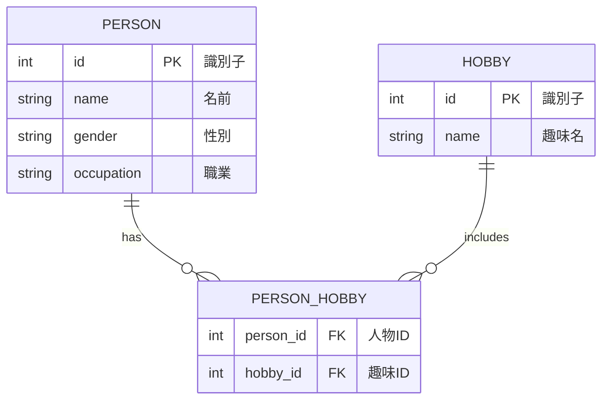

```mermaid
erDiagram
    PERSON {
        int id PK "識別子"
        string name "名前"
        string gender "性別"
        string occupation "職業"
    }

    HOBBY {
        int id PK "識別子"
        string name "趣味名"
    }

    PERSON_HOBBY {
        int person_id FK "人物ID"
        int hobby_id FK "趣味ID"
    }

    PERSON ||--o{ PERSON_HOBBY : has
    HOBBY ||--o{ PERSON_HOBBY : includes
```